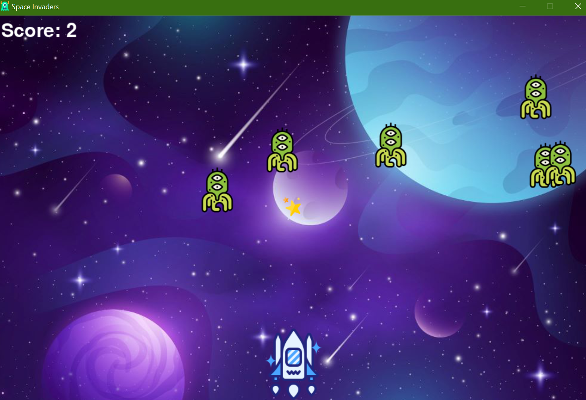

# PyGame Tutorial

The files of this repo are based on this tutorial: [Python Game Development Course - freeCodeCamp.org
 ](https://www.youtube.com/watch?v=FfWpgLFMI7w)

The icons copyright can be found in [Flaticon](https://www.flaticon.com/)

The backgroung image copyright is from [Freepik](https://www.freepik.com/free-vector/gradient-galaxy-background_14658088.htm)

